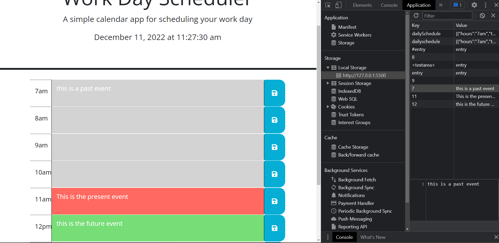

# Personal_planner

## Description
The purpose of this challenge was to create a Daily Schedule for an 8 hour working day 7am - 3pm where a user can save there entries. More with being able to save user entries the textblocks for each hour block will be highlighted when those time blocks are checked against the current time displayed. the highlighted colors will represent Grey for Past events, Green for Present events, and Red for Future events. Once the user clicks the save button on the page, the text is stored into localstorage on the users machine and saved onto the page, hence when the page refreshes the text remains on the time block.

## User Story

AS AN employee with a busy schedule
I WANT to add important events to a daily planner
SO THAT I can manage my time effectively

## Acceptance Criteria

GIVEN I am using a daily planner to create a schedule
WHEN I open the planner
THEN the current day is displayed at the top of the calendar
WHEN I scroll down
THEN I am presented with timeblocks for standard business hours
WHEN I view the timeblocks for that day
THEN each timeblock is color coded to indicate whether it is in the past, present, or future
WHEN I click into a timeblock
THEN I can enter an event
WHEN I click the save button for that timeblock
THEN the text for that event is saved in local storage
WHEN I refresh the page
THEN the saved events persist

## Tests   
Testing for this assignment included console.log of multiple functions to see what was happening with localstorage and how to grab it to print to the page. More so I went the different iterations of scripts to get the correct flow and objects working. 

## Screenshots
![GIF] (./Assets/Images/05-third-party-apis-homework-demo.gif)

## Deployment
[Website URL]:

(https://pietroxero.github.io/Personal_planner/)
